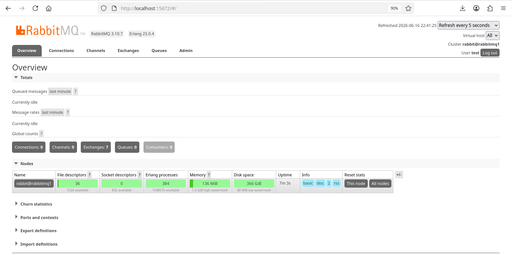
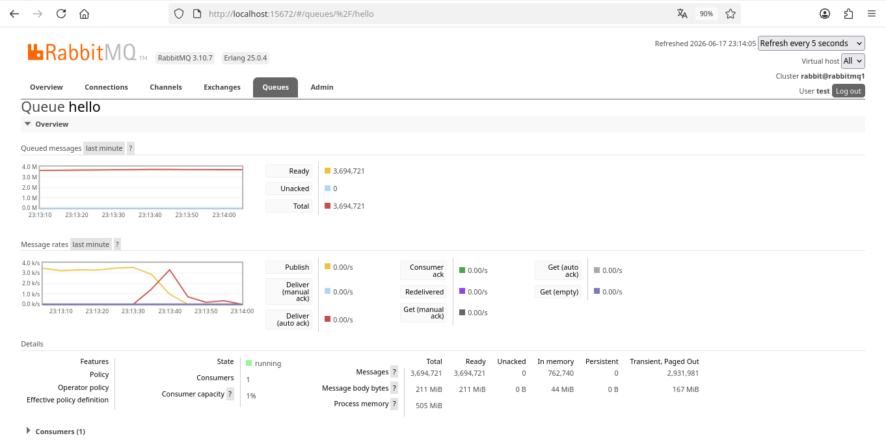
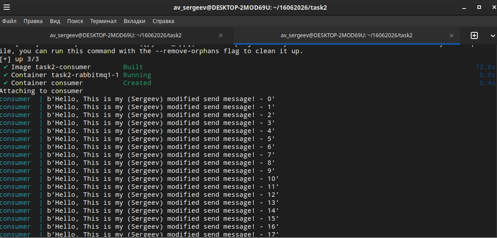
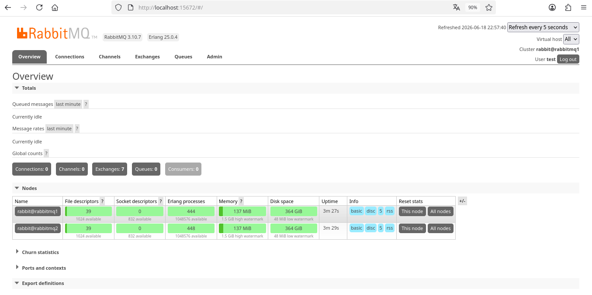
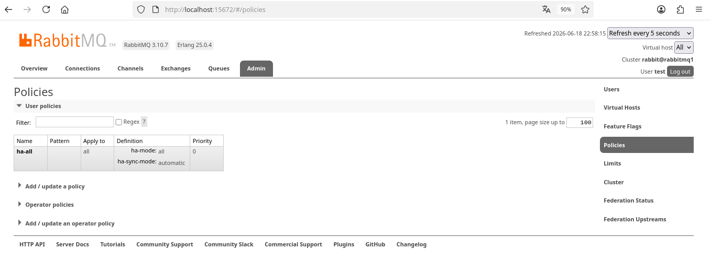
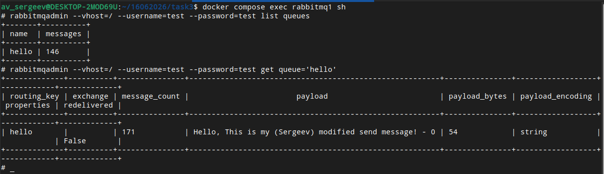
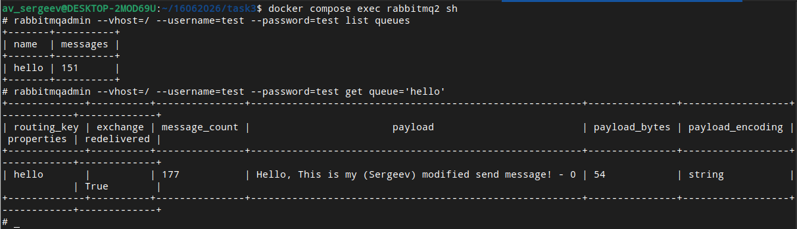
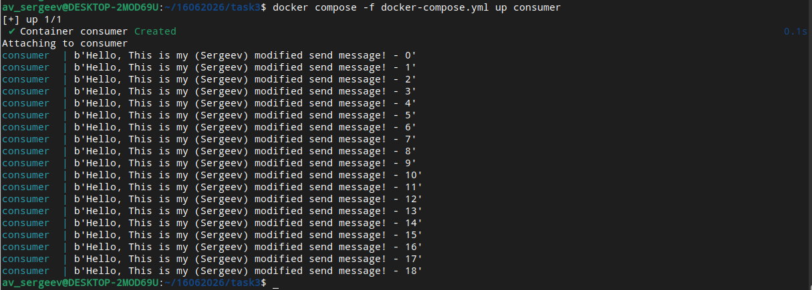

# Домашнее задание к занятию "Очереди RabbitMQ" - Сергеев Александр

### Инструкция по выполнению домашнего задания

   1. Сделайте `fork` данного репозитория к себе в Github и переименуйте его по названию или номеру занятия, например, https://github.com/имя-вашего-репозитория/git-hw или  https://github.com/имя-вашего-репозитория/7-1-ansible-hw).
   2. Выполните клонирование данного репозитория к себе на ПК с помощью команды `git clone`.
   3. Выполните домашнее задание и заполните у себя локально этот файл README.md:
      - впишите вверху название занятия и вашу фамилию и имя
      - в каждом задании добавьте решение в требуемом виде (текст/код/скриншоты/ссылка)
      - для корректного добавления скриншотов воспользуйтесь [инструкцией "Как вставить скриншот в шаблон с решением](https://github.com/netology-code/sys-pattern-homework/blob/main/screen-instruction.md)
      - при оформлении используйте возможности языка разметки md (коротко об этом можно посмотреть в [инструкции  по MarkDown](https://github.com/netology-code/sys-pattern-homework/blob/main/md-instruction.md))
   4. После завершения работы над домашним заданием сделайте коммит (`git commit -m "comment"`) и отправьте его на Github (`git push origin`);
   5. В личном кабинете прикрепите и отправьте ссылку на решение в виде md-файла в вашем Github.
   6. Любые вопросы по выполнению заданий спрашивайте в разделе “Вопросы по заданию” в личном кабинете.
   
Желаем успехов в выполнении домашнего задания!
   
### Дополнительные материалы, которые могут быть полезны для выполнения задания

1. [Руководство по оформлению Markdown файлов](https://gist.github.com/Jekins/2bf2d0638163f1294637#Code)

---

### Задание 1

Используя Docker compose, создал контейнер на образе RabbitMQ с management plug-in.
Зашел в веб-интерфейс http://localhost:15672/ и приложил скриншот веб-интерфейса RabbitMQ.

---

### Задание 2

Используя скрипты producer.py и consumer.py, провел тестовую отправку и получение сообщений.
Для отправки сообщений запустил скрипт producer.py.
Для работы скриптов использовал контейнеры на образе Python версии 3 с установкой библиотеки Pika.
В скриптах указал имя контейнера, на котором запущен RabbitMQ.

Зашел в веб-интерфейс и нашел очередь под названием hello и сделал скриншот.
После этого запустил скрипт consumer.py и сделал скриншот результата выполнения скрипта.
В качестве решения домашнего задания приложил оба скриншота, сделанные на этапе выполнения.
Для закрепления материала модифицировал скрипты (поменял название очереди и тело отправляемого сообщения).

---

### Задание 3

Используя Docker compose, создал второй контейнер с RabbitMQ.
Объединил два сервиса из контейнеров в кластер и создал политику ha-all на все очереди.
В качестве решения домашнего задания приложил скриншоты из веб-интерфейса с информацией о доступных нодах
в кластере и включённой политикой.

Также приложил вывод команды с двух нод: $ rabbitmqctl cluster_status

Для закрепления материала снова запустил скрипт producer.py (частоту отправки сообщений уменьшил до 1 сек).
Приложил скриншот выполнения команды на каждой из нод: $ rabbitmqadmin get queue='hello'

Отключил ноду rabbitmq1, к которой подключался из скрипта producer.py.
Затем поправил параметры подключения в скрипте consumer.py на ноду rabbitmq2 и запустил его.
Приложил скриншот результата работы второго скрипта.

